<p align="center">
  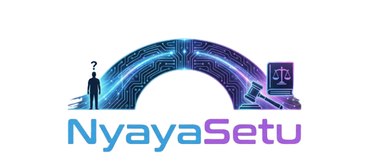
</p>

<h1 align="center">NyayaSetu</h1>
<p align="center"><strong>AI-Powered Legal Literacy for Every Indian Citizen</strong></p>

<p align="center">
  
  
  
  
  
</p>

---

NyayaSetu bridges the gap between complex Indian legal systems and everyday citizens. It provides legal **information** (not advice) through four specialized modules — each powered by Amazon Nova foundation models via AWS Bedrock.

> **Core principle:** *NyayaSetu refuses to speak when it cannot speak safely.* Every response is grounded in verifiable legal sources, and the system will explicitly refuse rather than risk giving incorrect information.

<p align="center">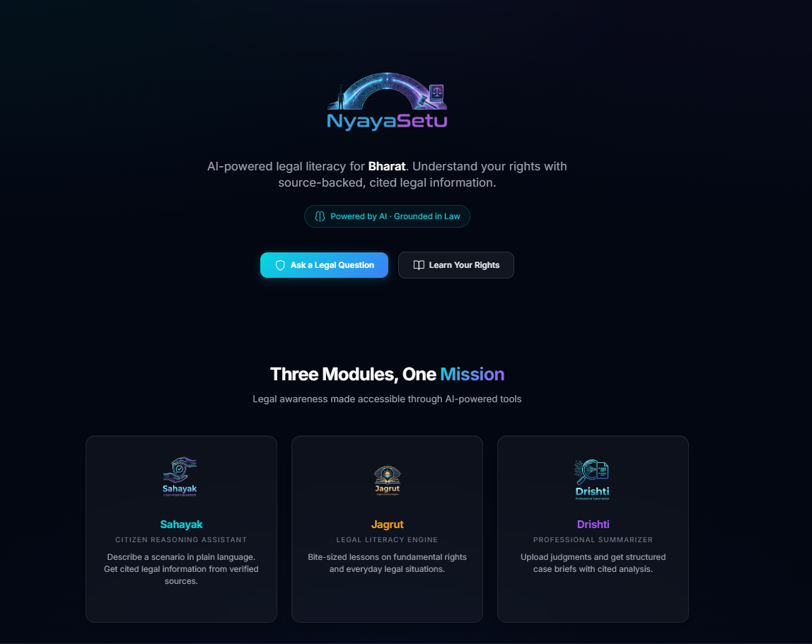</p>
<p align="center"><em>Landing page with access to all four modules — Sahayak, Jagrut, Drishti, and Know Your Rights</em></p>

---

## Modules

### Sahayak (Helper) — Legal Q&A

Ask legal questions in plain language. Describe your situation and Sahayak identifies the relevant jurisdiction, retrieves applicable laws from its knowledge base, and explains the legal position with citations to specific sections and Acts. It never gives advice — it tells you what the law says, cites exactly where, and lets you decide.

<p align="center">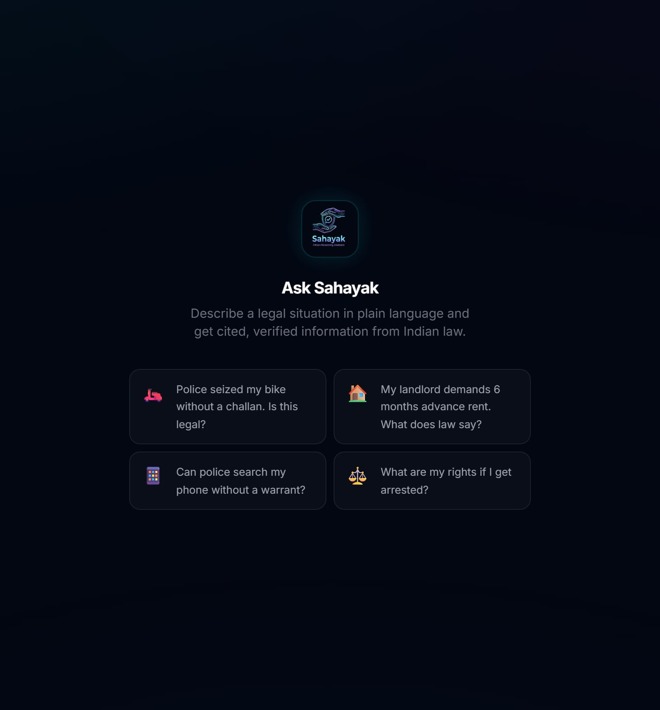</p>
<p align="center"><em>Chat interface where users describe their legal situation in plain language</em></p>

<p align="center">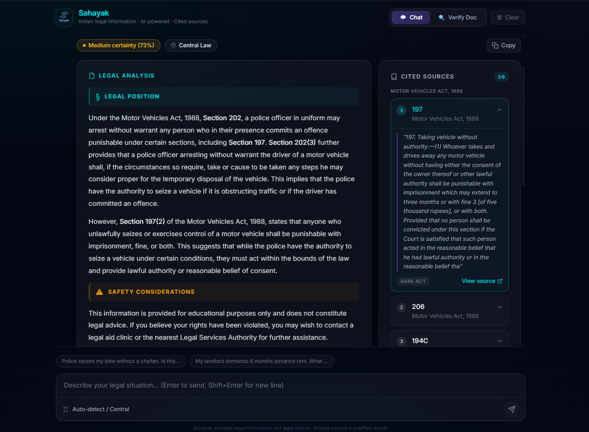</p>
<p align="center"><em>AI response with cited legal provisions, jurisdiction tag, certainty score, and safety disclaimer</em></p>

### Sahayak Verify — Document Authenticity

Upload a legal document (PDF, DOCX, or image) and get an instant authenticity analysis. The system checks formatting, language, dates, signatures, legal references, metadata, and internal consistency across 7 categories. It distinguishes between legitimate government documents and scam notices — the same emblem means "authentic" on an ED arrest order but "fraud" on a loan recovery letter.

<p align="center">
  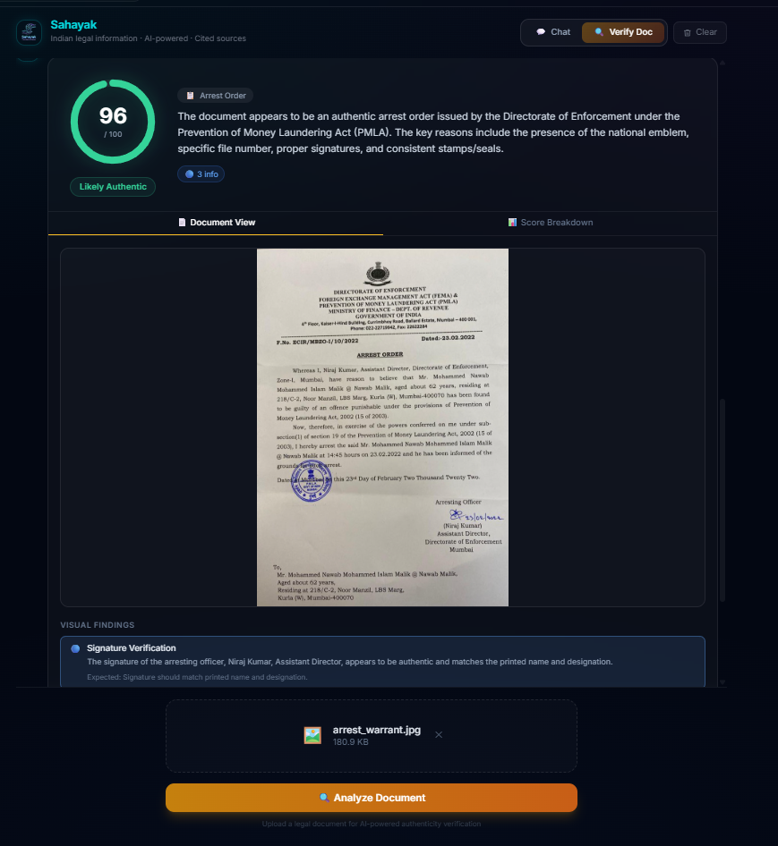
  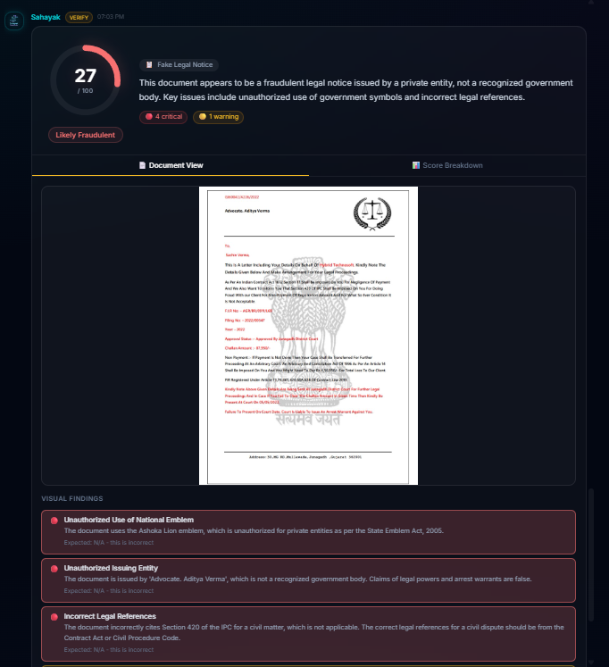
</p>
<p align="center"><em>Left: A legitimate government document scores high with green verdict. Right: A fake scam notice scores low with critical findings flagged across multiple categories.</em></p>

### Jagrut (Awakened) — Legal Education

Structured micro-learning modules covering Fundamental Rights, Police Powers, Traffic Laws, Tenancy, Consumer Rights, and Workplace Rights. Each lesson teaches a concept in plain language, followed by quizzes to test understanding.

<p align="center">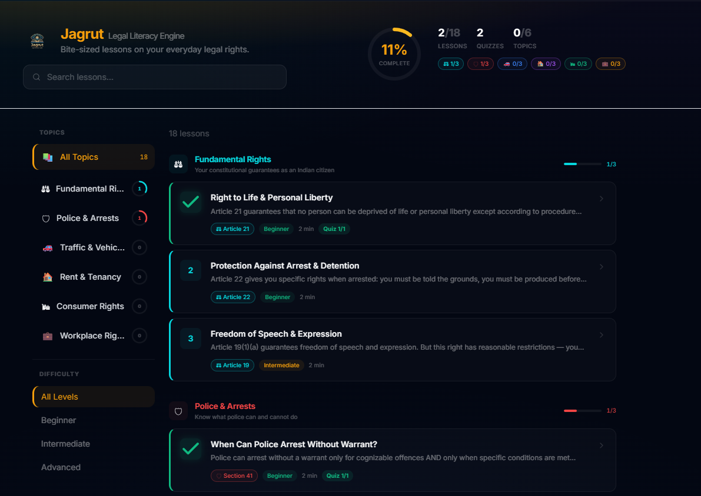</p>
<p align="center"><em>Lesson catalog grouped by legal topic with difficulty levels and progress tracking per category</em></p>

<p align="center">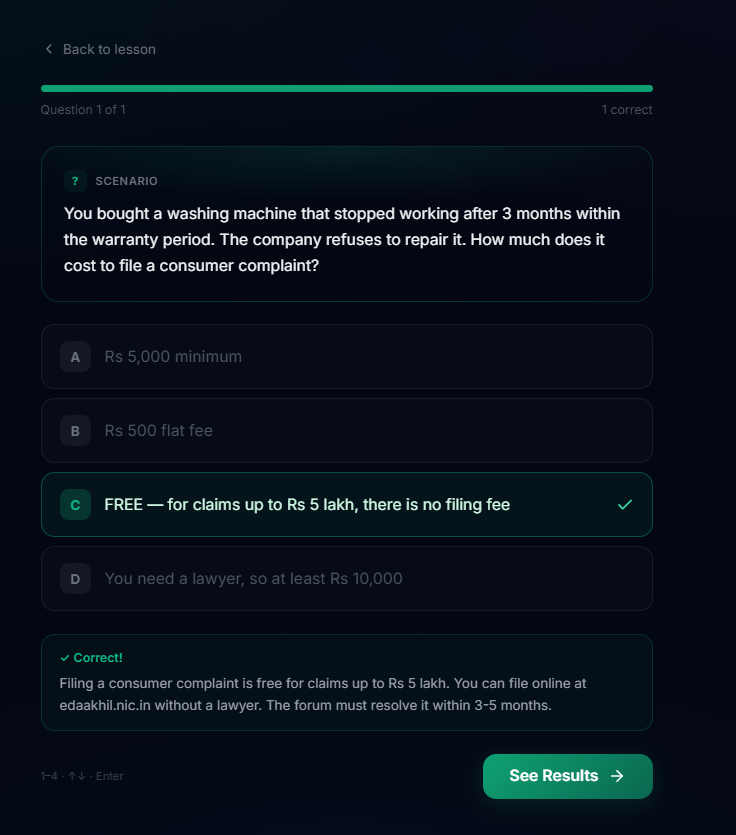</p>
<p align="center"><em>Interactive quiz after each lesson — tests understanding with immediate feedback and scoring</em></p>

### Know Your Rights

Interactive rights cards organized by category — quickly look up your fundamental rights with clear, plain-language explanations.

<p align="center">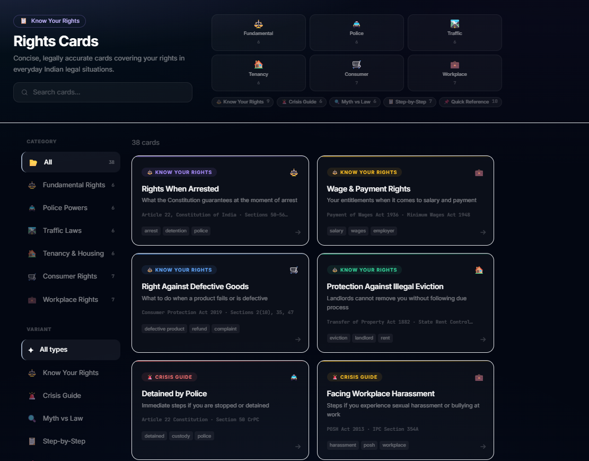</p>
<p align="center"><em>Rights organized by category — Fundamental Rights, Police Powers, Traffic Laws, Tenancy, and more</em></p>

<p align="center">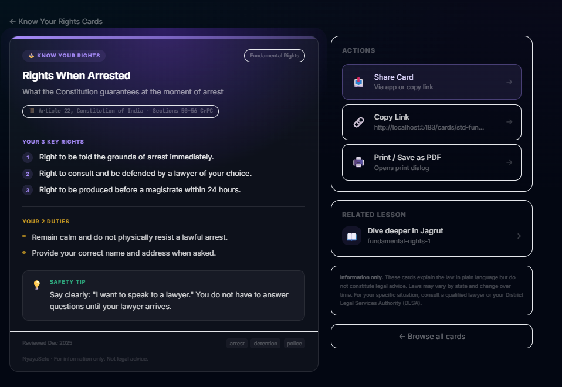</p>
<p align="center"><em>Each card explains a specific right in plain language with the relevant legal provision cited</em></p>

### Drishti (Vision) — Document Analysis

Upload a legal document and get a comprehensive case brief — facts, issues, legal provisions, argument analysis from both sides, precedent mapping, timeline extraction, and explanations at three reading levels (teen, law student, practitioner).

<p align="center">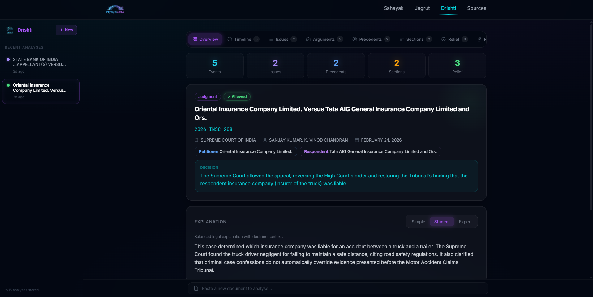</p>
<p align="center"><em>Full case brief with facts, issues, legal provisions, and outcome extracted from an uploaded document</em></p>

<p align="center">
  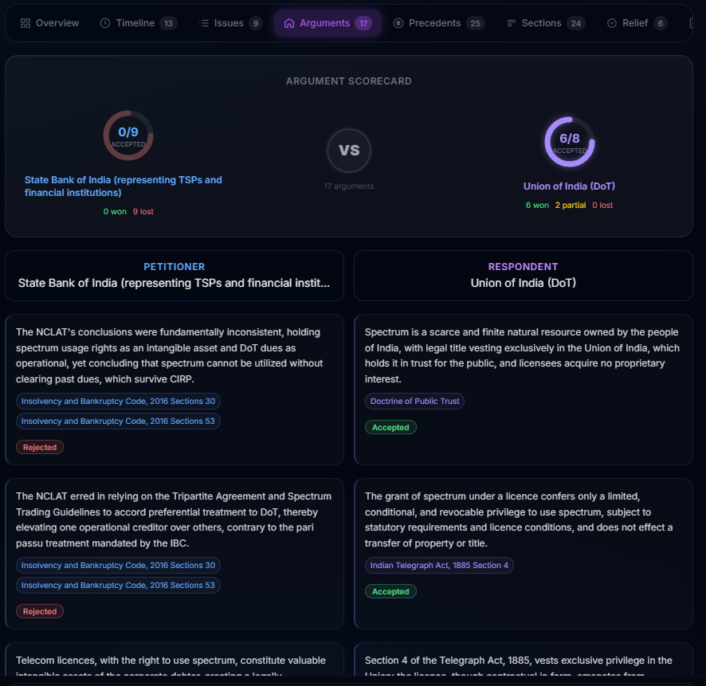
  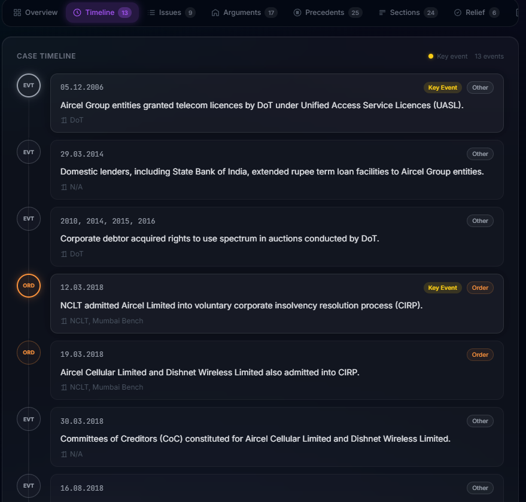
</p>
<p align="center"><em>Left: Argument duel — petitioner vs respondent arguments with strength scores. Right: Case timeline with key events extracted chronologically.</em></p>

<p align="center">
  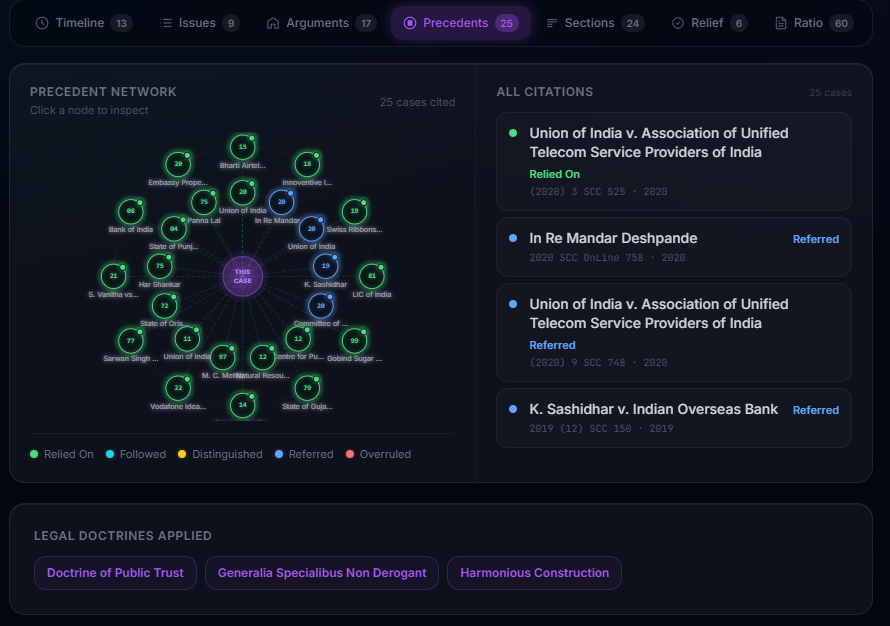
  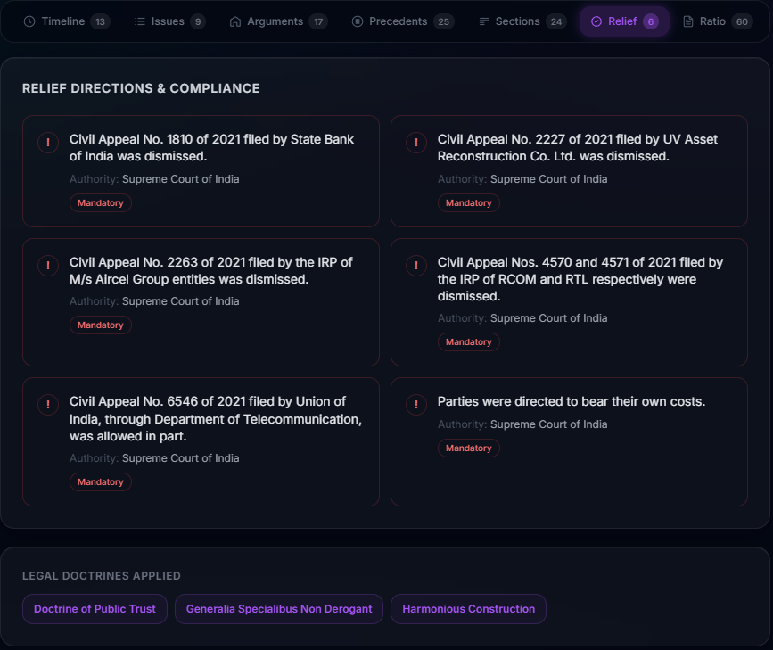
</p>
<p align="center"><em>Left: Precedent mapping showing cited cases and their relevance. Right: Relief directions and compliance requirements from the judgment.</em></p>

---

## Architecture

```
NyayaSetu/
├── apps/
│   ├── api/                 # Fastify backend (port 3029)
│   └── web/                 # React + Vite frontend (port 5183)
├── packages/
│   ├── shared-types/        # TypeScript interfaces (foundation)
│   ├── legal-rag/           # Retrieval-Augmented Generation pipeline
│   ├── jurisdiction/        # State-specific legal rules (symbolic)
│   ├── safety-layer/        # Guardrails, refusal logic, language checks
│   ├── prompts/             # Versioned LLM prompt templates
│   └── data-prep/           # PDF/DOCX parsing utilities
├── data/                    # Legal source material (Acts, cases, state rules)
├── infra/terraform/         # AWS infrastructure (DynamoDB, S3, IAM)
└── scripts/                 # Data ingestion utilities
```

### Tech Stack

| Layer | Technology |
|-------|-----------|
| **LLM** | Amazon Nova Lite via AWS Bedrock (text + multimodal) |
| **Embeddings** | Amazon Nova Multimodal Embeddings (1024-dim) |
| **Vector Store** | ChromaDB (local) / Bedrock Knowledge Bases (prod) |
| **Database** | DynamoDB (users, history, progress) |
| **Backend** | Fastify 5 + TypeScript |
| **Frontend** | React 19 + Vite + Tailwind CSS |
| **Monorepo** | Turborepo + pnpm workspaces |
| **IaC** | Terraform (AWS) |

### Safety Architecture

Every Sahayak query passes through a **9-step pipeline** with safety gates:

```
Input → Normalize → Extract Entities → Resolve Jurisdiction → Symbolic Rules
     → Vector Retrieval → LLM Generation → Citation Verification → Guardrails → Response
```

**The system will refuse to answer when:**
- No legal sources are found for the query
- Confidence falls below the certainty threshold (0.8)
- Retrieved sources conflict with each other
- Jurisdiction cannot be determined
- The response contains advisory language ("you should", "you must")

Refusals are shown calmly with a suggestion to consult a qualified legal professional, never as errors.

### Document Verification Pipeline

The Verify feature runs an **8-stage pipeline** analyzing documents for forgery:

```
Upload → Validate → Extract Text → Split Paragraphs
     → Text Analysis (Nova) → Visual Analysis (Nova Multimodal)
     → Cross-Reference Legal Citations → Score & Verdict
```

**7 scoring categories** (weighted): Legal References (25%), Consistency (20%), Dates (15%), Metadata (15%), Language (10%), Formatting (10%), Signatures (5%)

The system distinguishes between legitimate government documents (ED, CBI, courts) and scam notices

---

## Quick Start

### Prerequisites

- **Node.js** >= 20
- **pnpm** >= 9 (`npm install -g pnpm`)
- **AWS credentials** with Bedrock access
- **ChromaDB** running locally for vector storage (optional but recommended)

### Setup

```bash
# Clone and install
git clone https://github.com/SdSadat/NyayaSetu && cd NyayaSetu
pnpm install

# Configure environment
cp .env.example .env
# Edit .env with your AWS credentials and settings

# Build all packages (respects dependency order via Turborepo)
pnpm build

# Start development servers (API + Web)
pnpm dev
```

## API Endpoints

| Method | Endpoint | Description |
|--------|----------|-------------|
| `POST` | `/api/v1/sahayak/query` | Process a legal question |
| `POST` | `/api/v1/sahayak/verify` | Verify document authenticity (multipart upload) |
| `GET` | `/api/v1/jagrut/lessons` | List learning modules |
| `GET` | `/api/v1/jagrut/lessons/:id` | Get a specific lesson |
| `GET` | `/api/v1/jagrut/quiz/:lessonId` | Get quiz for a lesson |
| `POST` | `/api/v1/drishti/extract` | Upload and extract document text |
| `POST` | `/api/v1/drishti/analyze` | Analyze a legal document |
| `GET` | `/api/v1/drishti/history` | List analysis history |
| `POST` | `/api/v1/auth/register` | User registration |
| `POST` | `/api/v1/auth/login` | User login |
| `GET` | `/health` | Health check |

---

## Project Commands

```bash
pnpm build          # Build all packages and apps
pnpm dev            # Start dev servers with hot reload
pnpm typecheck      # Run TypeScript type checking
pnpm lint           # Run linter
pnpm format         # Format code with Prettier
pnpm test           # Run all tests
pnpm prepare:all    # Convert legal PDFs to JSON chunks
pnpm ingest:all     # Ingest chunks into vector store
```

Run for a specific package:
```bash
pnpm --filter @nyayasetu/api dev
pnpm --filter @nyayasetu/web dev
pnpm --filter @nyayasetu/safety-layer test
```

---

## Infrastructure

AWS resources are managed via Terraform in `infra/terraform/`:

```bash
cd infra/terraform
terraform init
terraform plan -var-file=environments/dev.tfvars
terraform apply -var-file=environments/dev.tfvars
```

**Provisioned resources:** DynamoDB tables (history, users, progress), S3 bucket, IAM roles.

---

## Legal Disclaimer

NyayaSetu is a **legal information tool**, not a legal advice service. All responses are AI-generated and grounded in publicly available legal texts. Users should consult a qualified legal professional for advice specific to their situation. The system's document verification feature provides AI-based analysis for informational purposes and does not constitute a legal opinion on document authenticity.

---
